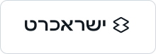

<div align="center">
  
  <h1>Misgeret</h1>
  <h3>Your financial picture. On your computer.</h3>
  <p>A free, open-source, local-first desktop app for Israeli household finance.</p>
</div>

<p align="center">
  <a href="https://github.com/OrMizrahi12/misgeret/releases/latest"></a>
  <a href="https://github.com/OrMizrahi12/misgeret/actions/workflows/ci.yml"></a>
  <a href="LICENSE"></a>
  <a href="https://github.com/OrMizrahi12/misgeret/releases"></a>
</p>

<p align="center">
  
  
  
  
</p>

<p align="center">
  <a href="https://github.com/OrMizrahi12/misgeret/releases/latest/download/MisgeretSetup.exe"></a>
  <a href="https://github.com/OrMizrahi12/misgeret/releases/latest"></a>
  <a href="https://github.com/OrMizrahi12/misgeret/releases/latest"></a>
  <a href="https://github.com/OrMizrahi12/misgeret/releases/download/v1.0.0/Misgeret-Full-Product-Tour-v1.0.0.mp4"></a>
</p>

<div align="center">
  <h2>Connects to nearly every bank and credit-card provider in Israel</h2>
  <p>All your accounts and cards come together in one clear, private, local financial picture.</p>
  <p><strong>10 banks · 4 credit-card providers</strong></p>
</div>

<p align="center"><sub><strong>Banks</strong></sub></p>

<table align="center">
  <tr>
    <td align="center" width="20%" bgcolor="#ffffff"><br><sub>Bank Leumi</sub></td>
    <td align="center" width="20%" bgcolor="#ffffff"><br><sub>Bank Hapoalim</sub></td>
    <td align="center" width="20%" bgcolor="#ffffff"><br><sub>Mizrahi-Tefahot</sub></td>
    <td align="center" width="20%" bgcolor="#ffffff"><br><sub>Discount Bank</sub></td>
    <td align="center" width="20%" bgcolor="#ffffff"><br><sub>Mercantile</sub></td>
  </tr>
  <tr>
    <td align="center" width="20%" bgcolor="#ffffff"><br><sub>First International</sub></td>
    <td align="center" width="20%" bgcolor="#ffffff"><br><sub>Otsar Hahayal</sub></td>
    <td align="center" width="20%" bgcolor="#ffffff"><br><sub>Bank Massad</sub></td>
    <td align="center" width="20%" bgcolor="#ffffff"><br><sub>Bank Yahav</sub></td>
    <td align="center" width="20%" bgcolor="#ffffff"><br><sub>PAGI</sub></td>
  </tr>
</table>

<p align="center"><sub><strong>Credit-card providers</strong></sub></p>

<table align="center">
  <tr>
    <td align="center" width="25%" bgcolor="#ffffff"><br><sub>Max</sub></td>
    <td align="center" width="25%" bgcolor="#ffffff"><br><sub>Isracard</sub></td>
    <td align="center" width="25%" bgcolor="#ffffff"><br><sub>Cal</sub></td>
    <td align="center" width="25%" bgcolor="#ffffff"><br><sub>American Express</sub></td>
  </tr>
</table>

<p align="center"><sub>Logos and trademarks belong to their respective owners and are shown solely to identify supported institutions. <a href="docs/assets/institutions/README.md">Brand-asset sources</a>.</sub></p>

No sign-up, Google login, trial, subscription, or payment. Install the app and enter a local profile immediately. The interface is currently Hebrew.

[Windows x64](https://github.com/OrMizrahi12/misgeret/releases/latest/download/MisgeretSetup.exe) · [macOS Apple Silicon](https://github.com/OrMizrahi12/misgeret/releases/latest/download/Misgeret-1.0.0-macOS-arm64.dmg) · [macOS Intel](https://github.com/OrMizrahi12/misgeret/releases/latest/download/Misgeret-1.0.0-macOS-x64.dmg) · [Linux DEB](https://github.com/OrMizrahi12/misgeret/releases/latest/download/Misgeret-1.0.0-Linux-x64.deb) · [Linux RPM](https://github.com/OrMizrahi12/misgeret/releases/latest/download/Misgeret-1.0.0-Linux-x64.rpm)


## What it does

- Brings income, spending, balances, cash flow, assets, liabilities, and net worth into one desktop app.
- Shows monthly and yearly views, recurring patterns, forecasts, planning goals, and 12 financial-health indicators.
- Connects multiple Israeli banks and credit-card providers through [`israeli-bank-scrapers`](https://github.com/eshaham/israeli-bank-scrapers).
- Reduces double counting by reconciling card settlements and excluding proven internal transfers.
- Keeps separate local profiles, backups, categorization rules, and CSV exports.

## Local-first, with explicit boundaries

Financial data is stored in a local SQLite database. Misgeret has no user-account server, financial-data cloud, advertising, analytics, or telemetry. Login fields are encrypted with AES-256-GCM; the master key is protected by Electron `safeStorage` and the operating system.

The transaction database itself is not encrypted at rest, so full-disk encryption and a protected OS account are recommended. During a sync, the app contacts the selected institution directly from your computer. Update checks contact GitHub Releases.

Misgeret is not a licensed Israeli financial-information provider and does not use regulated Open Banking. It automates institution websites, so provider changes may temporarily break a connection. See [Privacy and security](docs/privacy-and-security.md).

## Supported connections

Ten banks, four card providers, and two benefit clubs are currently offered. History depth and availability vary by provider and are shown in the app before connection.

## Build from source

Requires Node.js 24 and npm.

```powershell
npm install
npm run dev
npm run verify
```

Desktop packages are built for the current platform with:

```powershell
npm run desktop:make
```

The GitHub release workflow builds Windows x64, macOS arm64/x64, and Linux x64 packages. See [Development](docs/development.md), [Architecture](docs/architecture.md), and [Contributing](CONTRIBUTING.md).

## Community and contributing

- Start with [`good first issue`](https://github.com/OrMizrahi12/misgeret/labels/good%20first%20issue) or [`help wanted`](https://github.com/OrMizrahi12/misgeret/labels/help%20wanted).
- Use [GitHub Discussions](https://github.com/OrMizrahi12/misgeret/discussions) for questions and early ideas.
- See the [Roadmap](ROADMAP.md) for project direction and [Contributing](CONTRIBUTING.md) before opening a pull request.
- Read [Support](SUPPORT.md) for the correct public channel and [Security](SECURITY.md) for private vulnerability reporting.
- Every change to `main` goes through a pull request and automated CI.

## Signing status

The current Windows and macOS packages are not code-signed or notarized. SmartScreen or Gatekeeper may warn on first launch. Verify the release checksum and download only from this repository. Windows updates automatically through GitHub Releases; macOS and Linux updates are manual.

## License

[MIT](LICENSE). Misgeret is an educational awareness tool, not financial, pension, insurance, legal, or investment advice.

[עברית](README.md) · [Roadmap](ROADMAP.md) · [Discussions](https://github.com/OrMizrahi12/misgeret/discussions) · [Releases](https://github.com/OrMizrahi12/misgeret/releases) · [Security](SECURITY.md)
