<div align="center" dir="rtl">
  
  <h1>מסגרת</h1>
  <h3>התמונה הפיננסית שלך. אצלך.</h3>
  <p>אפליקציית Desktop חינמית ובקוד פתוח שמרכזת את התמונה הפיננסית של משקי בית בישראל — על המחשב שלך.</p>
</div>

<p align="center">
  <a href="https://github.com/OrMizrahi12/misgeret/releases/latest"></a>
  <a href="https://github.com/OrMizrahi12/misgeret/actions/workflows/ci.yml"></a>
  <a href="LICENSE"></a>
  <a href="https://github.com/OrMizrahi12/misgeret/releases"></a>
</p>

<p align="center">
  
  
  
  
  
</p>

<p align="center" dir="rtl">
  <a href="https://github.com/OrMizrahi12/misgeret/releases/latest/download/MisgeretSetup.exe"></a>
  <a href="#הורדה"></a>
  <a href="#הורדה"></a>
  <a href="https://github.com/OrMizrahi12/misgeret/releases/download/v1.0.0/Misgeret-Full-Product-Tour-v1.0.0.mp4"></a>
</p>

<p align="center" dir="rtl">
  <a href="#הורדה">הורדה</a> ·
  <a href="#מה-מסגרת-נותנת">יכולות</a> ·
  <a href="#מוסדות-נתמכים">בנקים ואשראי</a> ·
  <a href="#סיור-בכל-המסכים">כל המסכים</a> ·
  <a href="#פרטיות-ואבטחה">פרטיות</a> ·
  <a href="#קהילה-ותרומה">תרומה לפרויקט</a>
</p>

> [!IMPORTANT]
> **אין הרשמה, אין כניסה עם Google, אין תקופת ניסיון, אין מנוי ואין תשלום.** מורידים, מתקינים ונכנסים ישירות לפרופיל המקומי.

<table dir="rtl">
  <tr>
    <td align="center" width="25%"><strong>חינם באמת</strong><br><sub>MIT · ללא מנוי · ללא פרסומות</sub></td>
    <td align="center" width="25%"><strong>מקומי ופרטי</strong><br><sub>SQLite במחשב שלך · ללא ענן פיננסי</sub></td>
    <td align="center" width="25%"><strong>נבנה לישראל</strong><br><sub>בנקים, כרטיסים ושפה עברית מלאה</sub></td>
    <td align="center" width="25%"><strong>תמונה אחת ברורה</strong><br><sub>חודש · שנה · תחזית · הון · בריאות</sub></td>
  </tr>
</table>

<a href="https://github.com/OrMizrahi12/misgeret/releases/download/v1.0.0/Misgeret-Full-Product-Tour-v1.0.0.mp4">
  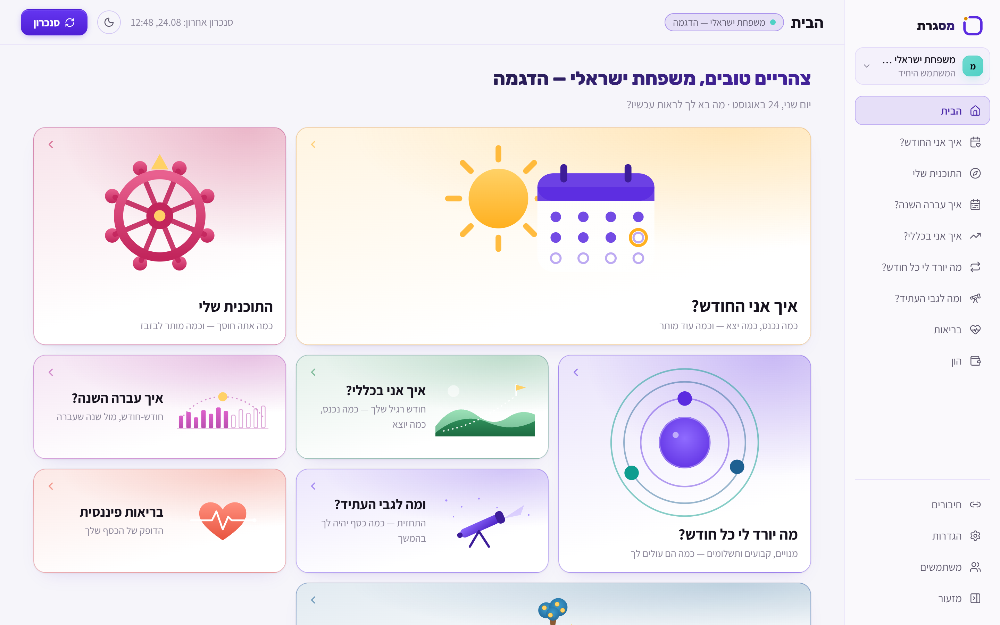
</a>

<p align="center" dir="rtl"><sub>▶ לחצו על התמונה לצפייה בסיור המלא · 5:26 דקות · כל הנתונים בסרטון ובצילומים סינתטיים בלבד</sub></p>

## הורדה

| מערכת | חבילה מומלצת | חלופה |
|---|---|---|
| Windows 10/11 x64 | [MisgeretSetup.exe](https://github.com/OrMizrahi12/misgeret/releases/latest/download/MisgeretSetup.exe) | — |
| macOS 13+ · Apple Silicon | [DMG](https://github.com/OrMizrahi12/misgeret/releases/latest/download/Misgeret-1.0.0-macOS-arm64.dmg) | [ZIP](https://github.com/OrMizrahi12/misgeret/releases/latest/download/Misgeret-1.0.0-macOS-arm64.zip) |
| macOS 13+ · Intel | [DMG](https://github.com/OrMizrahi12/misgeret/releases/latest/download/Misgeret-1.0.0-macOS-x64.dmg) | [ZIP](https://github.com/OrMizrahi12/misgeret/releases/latest/download/Misgeret-1.0.0-macOS-x64.zip) |
| Ubuntu/Debian x64 | [DEB](https://github.com/OrMizrahi12/misgeret/releases/latest/download/Misgeret-1.0.0-Linux-x64.deb) | — |
| Fedora/RHEL x64 | [RPM](https://github.com/OrMizrahi12/misgeret/releases/latest/download/Misgeret-1.0.0-Linux-x64.rpm) | — |

[כל קבצי הגרסה, SHA-256 והערות השחרור](https://github.com/OrMizrahi12/misgeret/releases/latest)

החבילות עדיין אינן חתומות או מאושרות ב־notarization. לכן Windows SmartScreen או macOS Gatekeeper עשויים להציג אזהרה. פרטי התקנה בטוחה נמצאים [בהמשך העמוד](#התקנה-לפי-מערכת-הפעלה).

## מה מסגרת נותנת

| | |
|---|---|
| **תמונה אחת במקום אקסלים**<br>הכנסות, הוצאות, תזרים, יתרות, נכסים, התחייבויות והון עצמי. | **חודש, שנה ומגמה**<br>כמה נכנס, כמה יצא, כמה נשאר ואיך המצב משתנה לאורך זמן. |
| **תחזית קדימה**<br>תזרים צפוי ותרחישי “מה אם” על בסיס הדפוסים המקומיים שלך. | **מנויים, קבועים והרגלים**<br>זיהוי דפוסים חוזרים כשההחלטה הסופית נשארת שלך. |
| **סיווג חכם ומקומי**<br>כללים, קטגוריות וחידוד עסקאות נשמרים במחשב שלך. | **כמה בנקים וכרטיסים יחד**<br>התאמת חיובי כרטיס והעברות פנימיות מצמצמת ספירה כפולה. |
| **פרופילים נפרדים**<br>לכל בן משפחה או עולם פיננסי מסד, חיבורים וגיבויים משלו. | **ייצוא וגיבוי**<br>CSV, גיבויים מקומיים ושחזור מתוך האפליקציה. |

## השוואה לשירותים ישראליים אחרים

ההשוואה מבוססת על האתרים ותנאי השימוש הרשמיים שנבדקו ב־24 באוגוסט 2026. היא אינה המלצה, והמחירים או היכולות של שירותים אחרים עשויים להשתנות.

| | Misgeret | RiseUp | FamilyBiz |
|---|---|---|---|
| מחיר | **חינם לחלוטין** | 55 ₪ לחודש או 528 ₪ לשנה אחרי חודש ניסיון | רוב יכולות הבסיס חינמיות; פרימיום שנתי 349.90 ₪ לפי האתר הרשמי |
| הרשמה וחשבון | **לא נדרשים** | נדרשים לצורך השירות והמינוי | נדרשים לצורך השירות |
| קוד מקור | **פתוח במלואו, MIT** | שירות קנייני; תנאי השימוש מגבילים העתקה והנדסה חוזרת | פלטפורמה קניינית; רכיבי קוד פתוח נלווים מורשים בנפרד |
| היכן נשמר המידע | **SQLite מקומי במחשב שלך** | מאגרי RiseUp ושירותי ענן, לרבות AWS ו־MongoDB | מאגרי FamilyBiz וספקי אחסון/גיבוי, בישראל או בחו״ל |
| חיבור למוסדות | התחברות אוטומטית מאובטחת מאותו מחשב באמצעות `israeli-bank-scrapers` | בנקאות פתוחה מפוקחת, ללא מסירת סיסמת הבנק | בנקאות פתוחה מפוקחת, ללא מסירת סיסמת הבנק |
| מודל שירות | תוכנת Desktop קהילתית, ללא מוקד שירות | שירות מנוהל עם קהילה ותמיכה | שירות מנוהל עם תמיכה ויכולות פיננסיות רחבות |
| מערכות הפעלה להפצה | **Windows, macOS ו־Linux** | שירות מקוון | אפליקציית מובייל |

מקורות: [מחירי RiseUp](https://www.riseup.co.il/), [פרטיות RiseUp](https://www.riseup.co.il/privacy-policy/), [תנאי RiseUp](https://www.riseup.co.il/termsofuse/), [FamilyBiz — יכולות, הרשמה ומחיר](https://familybiz.co.il/), [פרטיות FamilyBiz](https://www.familybiz.co.il/legal/privacy), [תנאי FamilyBiz](https://www.familybiz.co.il/legal/terms).

RiseUp ו־FamilyBiz מציעות חיבורי בנקאות פתוחה מפוקחים ושירות מנוהל. מסגרת מיועדת למי שמעדיף אפליקציה מקומית, ללא חשבון, עם שליטה בקוד ובנתונים. מסגרת אינה בעלת רישיון “נותן שירות מידע פיננסי” ואינה משתמשת ב־Open Banking; היא מפעילה אוטומציה מול אתרי המוסדות, ולכן שינוי באתר בנק עלול להשבית חיבור עד לעדכון הספרייה.

## מוסדות נתמכים

מסגרת מציעה כרגע **16 סוגי חיבור** דרך הספרייה הפתוחה [`israeli-bank-scrapers`](https://github.com/eshaham/israeli-bank-scrapers):

- **בנקים:** הפועלים, לאומי, מזרחי־טפחות, דיסקונט, מרכנתיל, אוצר החייל, הבינלאומי, מסד, יהב ופאג״י.
- **כרטיסי אשראי:** כאל, Max, ישראכרט ואמריקן אקספרס.
- **מועדונים:** ביחד בשבילך ובהצדעה.

> זמינות ועומק ההיסטוריה משתנים בין מוסדות (בדרך כלל 3–24 חודשים). נכון ל־24 באוגוסט 2026, חיבור בנק הפועלים מסומן באפליקציה כתקלה ידועה בעקבות שינוי באתר הבנק. מסך החיבורים מציג לפני ההתחברות את העומק והמצב הידועים לכל מוסד.

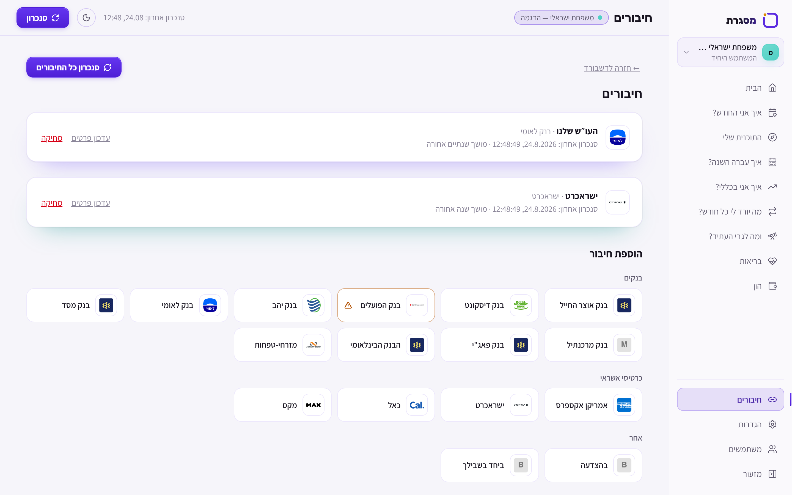

## סיור בכל המסכים

<details>
<summary><strong>הבית</strong> — נקודת כניסה לכל אזורי האפליקציה</summary>


</details>

<details>
<summary><strong>איך אני החודש?</strong> — הכנסות, הוצאות, יעד חיסכון, קטגוריות ועסקאות</summary>

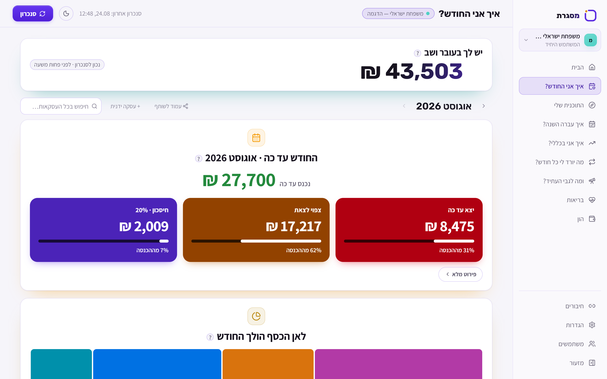
</details>

<details>
<summary><strong>התוכנית שלי</strong> — יעד חודשי, תקציב פנוי, המלצות ויעדים אישיים</summary>

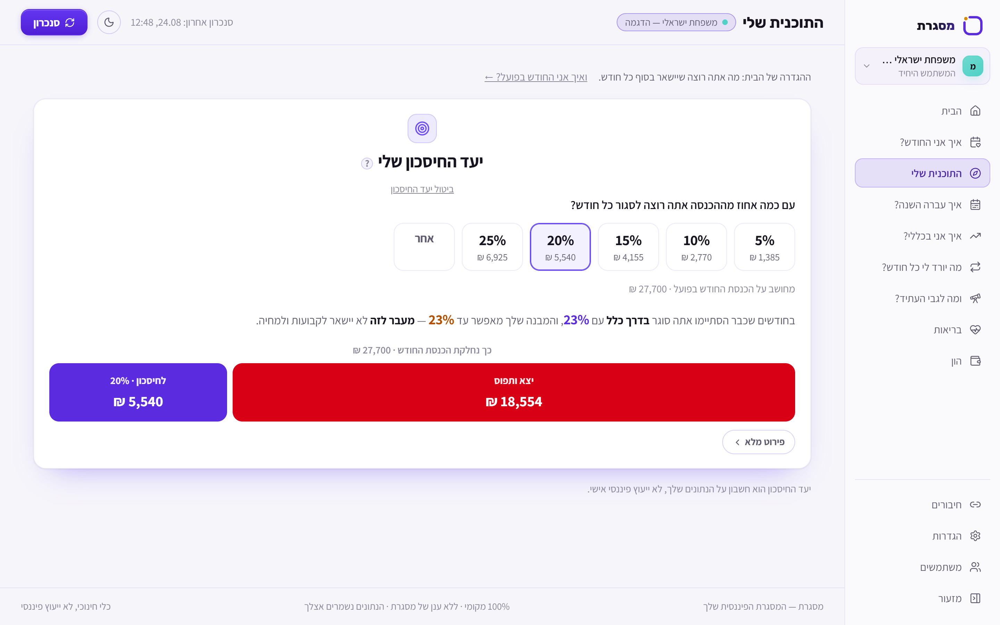
</details>

<details>
<summary><strong>איך עברה השנה?</strong> — השוואה חודשית ושנתית של הכנסות, הוצאות ומה שנשאר</summary>

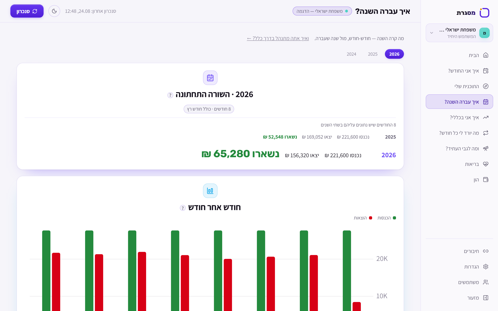
</details>

<details>
<summary><strong>איך אני בכללי?</strong> — הממוצע הרגיל שלך, מגמות ופרופיל תזרים</summary>

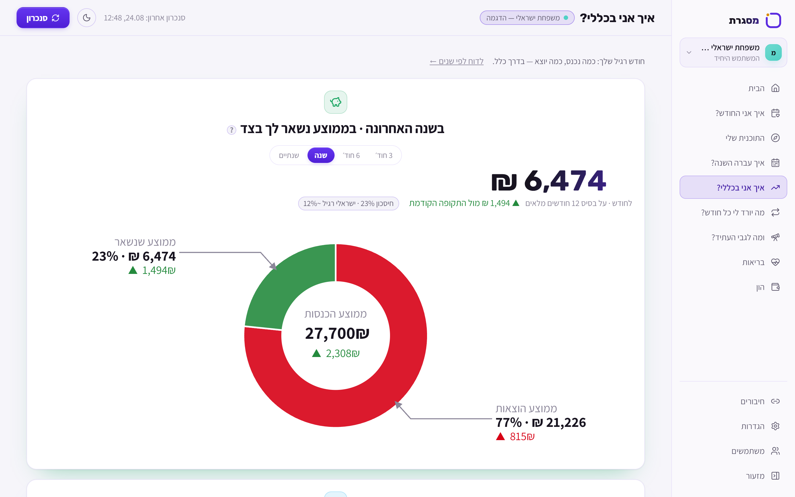
</details>

<details>
<summary><strong>מה יורד לי כל חודש?</strong> — מנויים, חיובים קבועים, הרגלים ותשלומים פתוחים</summary>

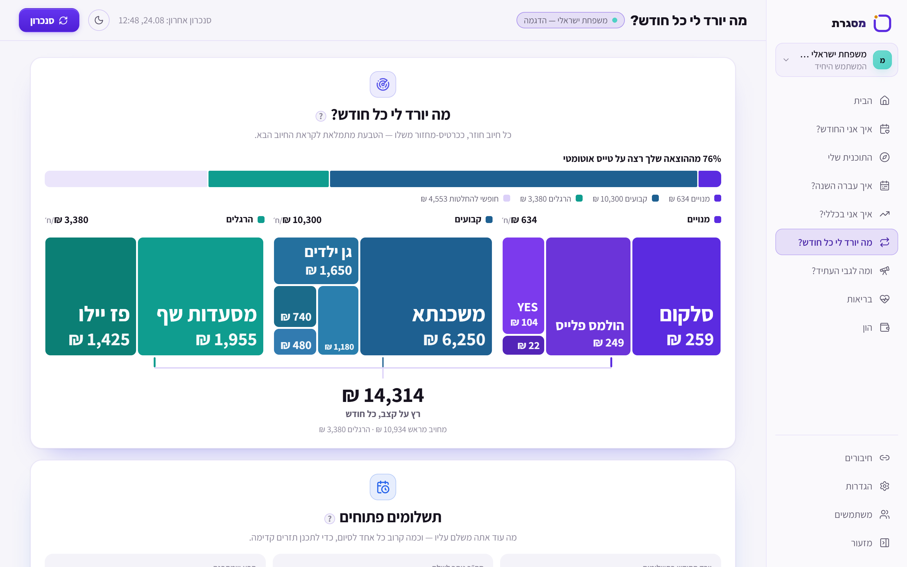
</details>

<details>
<summary><strong>ומה לגבי העתיד?</strong> — תחזית תזרים ותרחישים קדימה</summary>

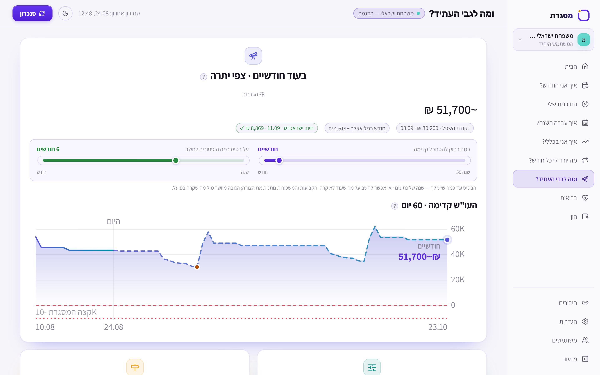
</details>

<details>
<summary><strong>בריאות פיננסית</strong> — 12 מדדים שמסבירים את החוסן והסיכון</summary>

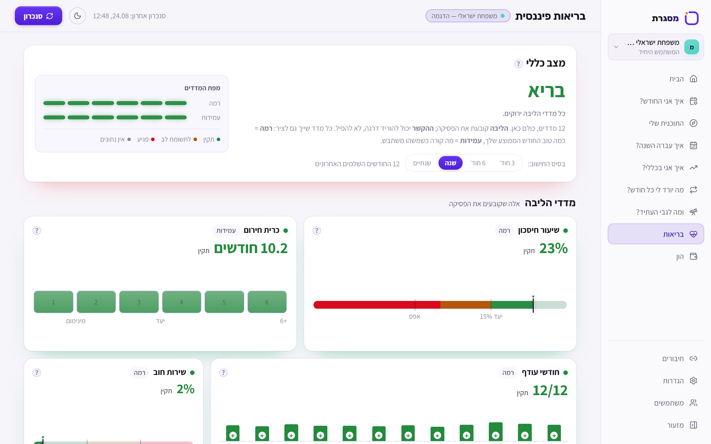
</details>

<details>
<summary><strong>הון</strong> — נכסים, התחייבויות, נזילות והון עצמי</summary>

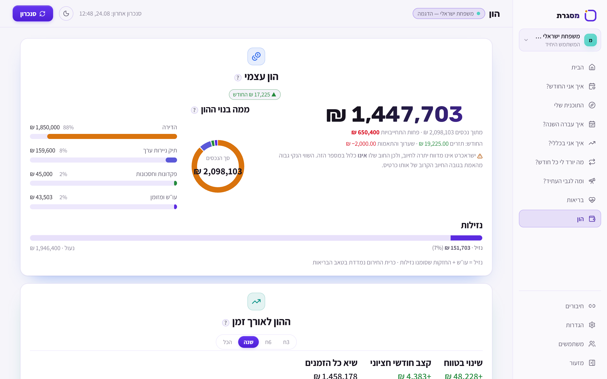
</details>

<details>
<summary><strong>חיבורים</strong> — בנקים, כרטיסים, מצב סנכרון ועומק היסטוריה</summary>


</details>

<details>
<summary><strong>הגדרות</strong> — תצוגה, חודש פיננסי, גיבוי, ייצוא ועדכונים</summary>

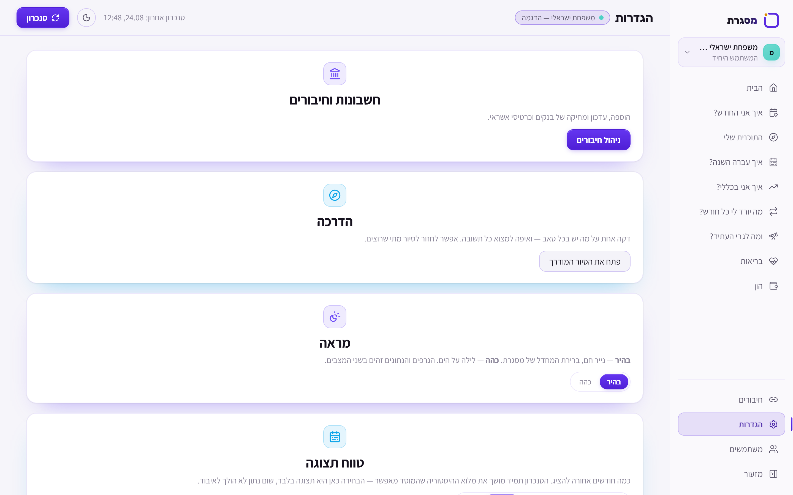
</details>

<details>
<summary><strong>ניהול משתמשים</strong> — עולמות נתונים מקומיים ונפרדים לחלוטין</summary>

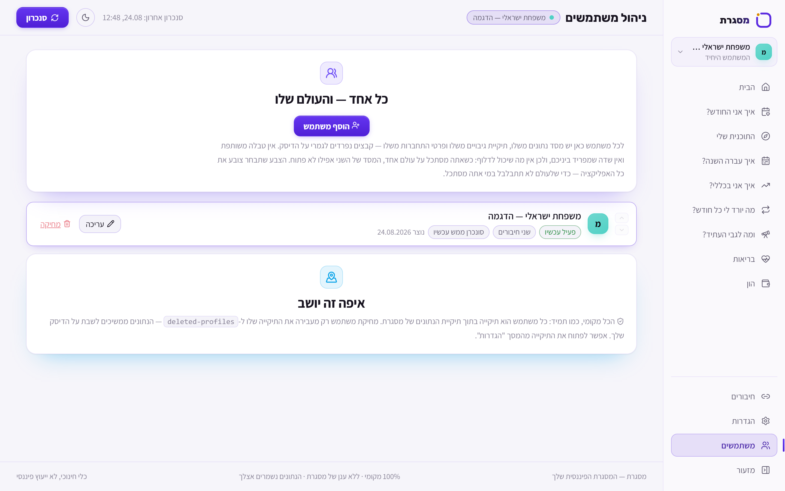
</details>

<details>
<summary><strong>חידוד סיווגים</strong> — אישור קטגוריה ויצירת כלל לעסקאות דומות</summary>

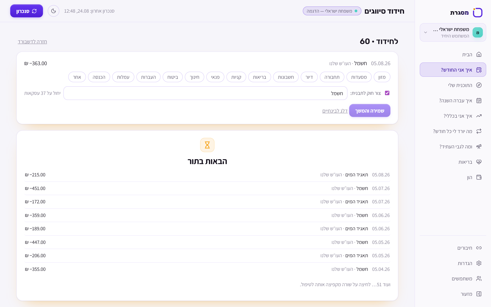
</details>

## פרטיות ואבטחה

- נתוני העסקאות, ההגדרות, הכללים והנכסים נשמרים ב־SQLite בתוך תיקיית האפליקציה של המשתמש.
- אין ל־Misgeret שרת חשבונות, ענן נתונים, פרסום, analytics או telemetry.
- פרטי ההתחברות מוצפנים ב־AES-256-GCM. מפתח ההצפנה מוגן באמצעות Electron `safeStorage` ומנגנון מערכת ההפעלה; ב־Linux נדרש keyring מאובטח.
- מסד העסקאות עצמו **אינו מוצפן במנוחה**. מי שיש לו גישה לחשבון מערכת ההפעלה ולקבצים המקומיים עשוי לקרוא אותו; מומלץ להשתמש בהצפנת דיסק ובחשבון מערכת מוגן.
- בסנכרון, האפליקציה מתקשרת ישירות מאותו מחשב עם אתרי הבנק/האשראי. בדיקת עדכונים מתקשרת ל־GitHub Releases. הנתונים אינם נשלחים לשרת של Misgeret, משום שאין שרת כזה.
- האפליקציה אינה יכולה לבצע העברות או פעולות בחשבון; היא קוראת תנועות ויתרות דרך אתרי המוסדות.

המודל המלא, מיקומי הקבצים והנחיות הגיבוי נמצאים ב־[פרטיות ואבטחה](docs/privacy-and-security.md). לדיווח אחראי על חולשה, ראו [SECURITY.md](SECURITY.md).

## התקנה לפי מערכת הפעלה

### Windows

1. הורידו את `MisgeretSetup.exe` מעמוד ה־Release.
2. אם SmartScreen מופיע, ודאו שהקובץ הגיע מ־repository זה והשוו את ה־SHA-256, ואז בחרו **מידע נוסף → הפעל בכל זאת**.
3. ההתקנה היא למשתמש הנוכחי. עדכונים עתידיים יורדו אוטומטית דרך GitHub Releases.

בדיקת checksum ב־PowerShell:

```powershell
Get-FileHash .\MisgeretSetup.exe -Algorithm SHA256
```

### macOS

1. הורידו DMG שמתאים למעבד: `arm64` ל־Apple Silicon או `x64` ל־Intel.
2. גררו את Misgeret אל Applications.
3. בגלל שהאפליקציה עדיין אינה חתומה/notarized, פתחו אותה בפעם הראשונה באמצעות קליק ימני → **Open** ואשרו את האזהרה.
4. עדכונים ל־macOS מותקנים ידנית מעמוד ה־Releases.

### Linux

Debian/Ubuntu:

```bash
sudo apt install ./Misgeret-1.0.0-Linux-x64.deb
```

Fedora/RHEL:

```bash
sudo dnf install ./Misgeret-1.0.0-Linux-x64.rpm
```

נדרש שירות Secret Service/keyring פעיל כדי להגן על מפתח פרטי ההתחברות. עדכונים ל־Linux מותקנים ידנית מעמוד ה־Releases.

## פיתוח מקומי

דרישות: Node.js 24, ‏npm, ו־Windows x64 / macOS x64 או arm64 / Linux x64.

```powershell
npm install
npm run dev
```

נתוני דמו מבודדים, ללא פנייה לבנק:

```powershell
$env:DATA_DIR="$PWD\.demo-data"
$env:MOCK_BANK='1'
$env:MOCK_PROFILE='showcase'
$env:MISGERET_CREDENTIAL_KEY=('11' * 32)
npm run dev
```

לפני Pull Request:

```powershell
npm run verify
```

פרטים נוספים: [מדריך פיתוח](docs/development.md) · [ארכיטקטורה](docs/architecture.md) · [נתוני ההדגמה וצילומי המסך](docs/demo-data.md) · [איך לתרום](CONTRIBUTING.md)

## קהילה ותרומה

- התחלה מומלצת: [`good first issue`](https://github.com/OrMizrahi12/misgeret/labels/good%20first%20issue) או [`help wanted`](https://github.com/OrMizrahi12/misgeret/labels/help%20wanted).
- שאלות ורעיונות מוקדמים: [GitHub Discussions](https://github.com/OrMizrahi12/misgeret/discussions).
- כיוון הפרויקט: [Roadmap](ROADMAP.md).
- עזרה, דיווח באגים ודיווח חולשות: [Support](SUPPORT.md) · [Security](SECURITY.md).
- כל שינוי ל־`main` עובר Pull Request ובדיקת CI אוטומטית.

## רישיון ואחריות

Misgeret מופצת תחת [MIT License](LICENSE). זו תוכנה קהילתית וכלי חינוכי למודעות פיננסית — לא ייעוץ פיננסי, פנסיוני, ביטוחי, משפטי או השקעותי. השימוש באחריות המשתמש; מומלץ לבדוק נתונים מהותיים מול המקור.

---

[English README](README.en.md) · [Roadmap](ROADMAP.md) · [Discussions](https://github.com/OrMizrahi12/misgeret/discussions) · [Issues](https://github.com/OrMizrahi12/misgeret/issues) · [Security](SECURITY.md)
